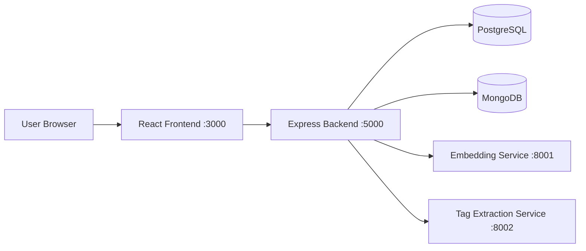
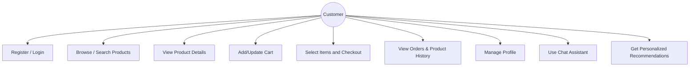
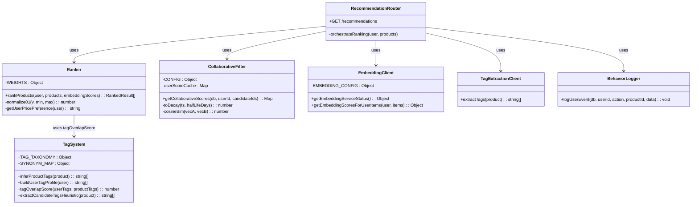
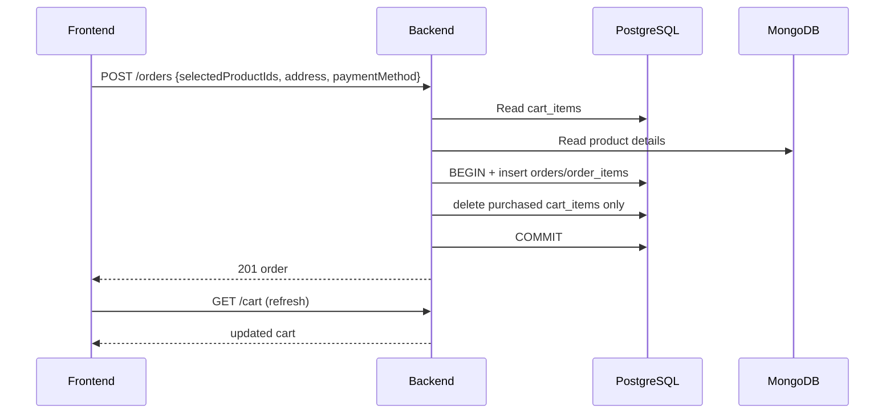
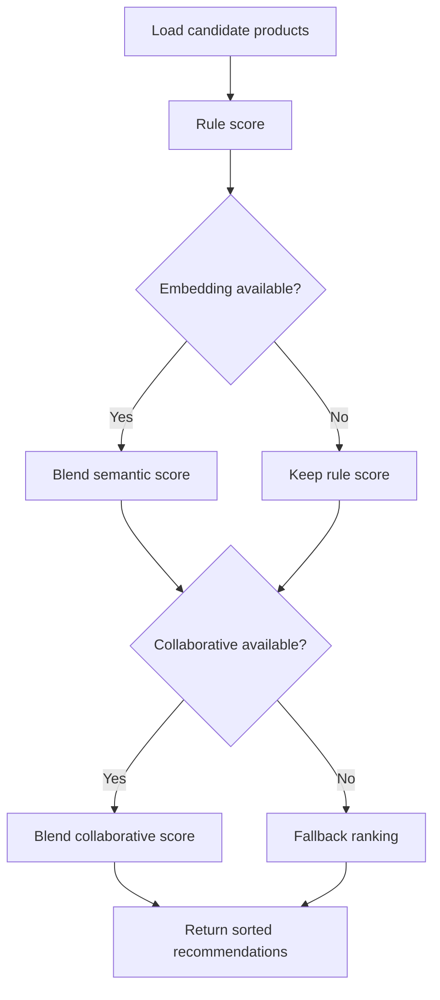
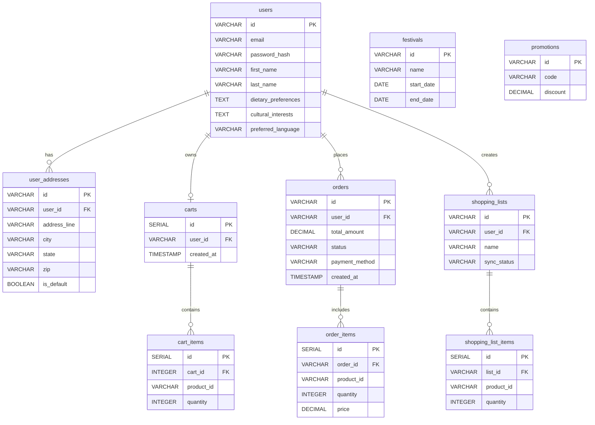
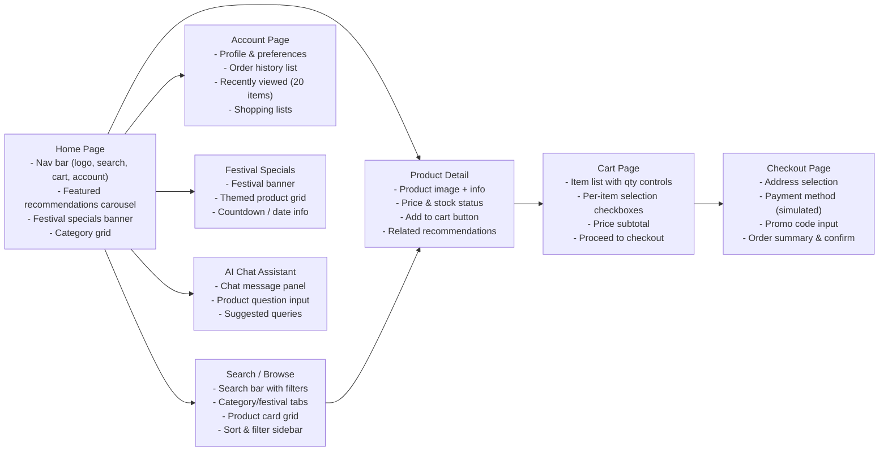

# CS5500 Final Project Report

## Project Title
**AI-Driven Personalized Shopping Experience for Hypermarket Retail**

---

## 1) Introduction and Problem Definition

The way people shop has shifted over the years. Customers now expect a more tailored experience when they shop. Traditional hypermarket systems still rely on manual browsing and one-size-fits-all promotions. This does not work well for customers. AI and web technologies now make it possible to build systems that match products to individual preferences. These systems can combine online and in-store shopping. This project builds a web-based shopping platform aimed at hypermarket retail.

The current way of shopping in hypermarkets has issues. It does not help customers find what they want well. Online and in-store channels are poorly integrated. Finding the right products takes too long, especially around holidays and cultural festivals. Existing systems lack shopping list management and quick-query assistance. This is a problem for customers. Means that stores miss out on sales. We need a system that uses AI to help customers find what they want. That combines online and in-store shopping.

---

## 2) Project Motivation and Scope

### Motivation

This project has a few goals. The first goal is to build an AI-driven web application for hypermarket product discovery. It uses user profiling and behavioral data to generate recommendations. The second goal is to implement a hybrid recommendation engine combining collaborative and content-based filtering. The third goal is to bridge online and in-store shopping through real-time shopping list synchronization. The fourth goal is consent-based personalization — only using data the user explicitly provides.

### Scope

In-scope:

* Let customers make and manage their accounts

* Let customers search for products and look at product details

* Let customers put products in their cart and check out

* Let customers look at their order history and the products they have looked at

* Make a system that suggests products based on what customers like and how they behave

* Add a chatbot that can answer customers questions

* Make it possible to demo the system on a network

Out-of-scope:

* Real payment processing

* Enterprise-scale concurrent user support

* Production monitoring and observability

### Sprint Planning

We split the project into two-week sprints. We have a team of five people. Each member contributed roughly 8-10 hours per week.

| Sprint | Phase | Duration | Goal | Status |
|---|---|---|---|---|
| Sprint 0 | Analysis | Jan 30 - Feb 9 | Figure out what we need to do and plan the project | Completed |
| Sprint 1 | System Design | Feb 10 - Mar 1 | Plan the architecture and design of the system | Completed |
| Sprint 2 | Core Infrastructure | Mar 2 - Mar 14 | Set up the parts of the system | Completed |
| Sprint 3 | Advanced Features | Mar 15 - Mar 28 | Add features to the system | Completed |
| Sprint 4 | Testing & Hardening | Mar 29 - Apr 5 | Test the system and make it more stable | Completed |
| Buffer | Final Submission | Apr 6 - Apr 12 | Finish the project and get it ready to submit | Completed |

---

## 3) Requirements Summary

### 3.1 Functional Requirements

Here are the things that the system needs to do:

* Let customers make and manage their accounts

* Let customers search for products and look at product details

* Let customers put products in their cart and check out

* Let customers look at their order history and the products they have looked at

* Make a system that suggests products based on what customers like and how they behave

* Add a chatbot that can answer customers questions

* Let customers make and manage their shopping lists

### 3.2 Non-Functional Requirements

Here are the things that the system needs to be able to do:

* Respond quickly to customers requests

* Work even when some parts of the system are not working

* Keep customers information safe

* Be easy to maintain and update

* Work on types of computers

* Be easy for customers to use

### 3.3 User Stories

User stories (summarized):

* Make an account so they can use the shopping features

* Set their preferences so they can get recommendations that're relevant to them

* Sign in securely so their information is protected

* Search for products so they can find what they want to buy

* Get recommendations based on what they like and how they behave

* Get suggestions for holidays and special events

* Add and remove products from their cart

* Check out and pay for their products

* See their points. Rewards

* Understand how the promotion logic works

* Make and manage their shopping lists

* Get help from a chatbot

### 3.4 Constraints & Assumptions

Constraints:

* Local machines have limited RAM (Qwen needs ~14GB alone)

* PostgreSQL and MongoDB must be pre-installed

* ML model files (~16GB total) excluded from Git via `.gitignore`

* Payment is simulated — no real transactions

---

## 4) Proposed Features

Planned features:

* Personalized homepage recommendations per user

* Festival-specific product pages (Lunar New Year, Diwali, etc.)

* Behavior-driven collaborative filtering

* Recently viewed products (last 20) in account page

* Selective checkout — choose which cart items to pay for

* AI chatbot via OpenAI API with keyword fallback

---

## 5) Technology Stack and Justification

Tech stack:

* React for the frontend

* Node.js and Express for the backend

* JWT and bcrypt for authentication and security

* PostgreSQL for the database

* MongoDB for the document database

* Python and BAAI/bge-m3 for the AI embedding service

* Python and Qwen2.5-7B for the AI tag service

* Git, npm and PowerShell/Bash scripts for tooling

---

## 6) Architecture & Design Summary

### 6.1 Architecture Style

System layers:

* UI: React

* API: Express/Node.js

* Relational data: PostgreSQL

* Document data: MongoDB

* Embedding service: Python/FastAPI + BAAI/bge-m3

* Tag extraction service: Python/FastAPI + Qwen2.5-7B

### 6.2 Architecture Diagram

### 6.3 Use Case Diagram

### 6.4 UML Class Diagram

### 6.5 UML Sequence (Checkout, Simplified)

### 6.6 Activity (Recommendation Flow)

### 6.7 Database Schema (ER Diagram)

#### PostgreSQL Schema

#### MongoDB Collections

We have collections, in MongoDB. Here are the key ones:

* `products`. Stores product information

  + Fields: name, description, price, category, tags, dietaryInfo, festivalTags, imageUrl, rating, reviewCount

  Used by: Product routes, recommendation ranker

* The database has two parts: `chat_conversations` and `user_activity_logs`.

The `chat_conversations` part stores all the conversations that users have with each other.

It has a few fields like `userId` and `messages` and `createdAt`.

The `user_activity_logs` part stores what users do on the site.

It has fields like `userId` and `action` and `productId` and `timestamp` and `metadata`.

The Chat route uses the `chat_conversations` part.

The Collaborative filtering and view history use the `user_activity_logs` part.

* Product IDs are the same in PostgreSQL and MongoDB.

---

## 7) Implementation Summary

### 7.1 Core Modules

* **Auth** handles signing in and out.

It has routes like `POST /api/auth/register` and `POST /api/auth/login`.

It issues JWT tokens, hashes passwords with bcrypt, and blocks duplicate emails.

* **Products** handles things related to products.

It has routes like `GET /api/products` and `GET /api/products/:id`.

Supports category, keyword, and festival-tag filtering. Logs a `view_product` event on each detail page visit.

* **Cart** handles things related to the cart.

It has routes like `GET/POST/PUT/DELETE /api/cart`.

It handles adding and removing items from the cart.

It gets product information from MongoDB.

* **Checkout** handles the checkout process.

It has a route like `POST /api/orders`.

It wraps the order creation in a PG transaction so nothing gets half-saved.

* **Account** handles things related to the users account.

It has a route like `GET /api/users/me/view-history`.

Shows order history from PG and the last 20 viewed products from Mongo activity logs.

* **Recommendations** handles giving users product recommendations.

It has a route like `GET /api/recommendations`.

It runs a 4-stage pipeline to pick which products to show.

### 7.2 Enhancements in Final Sprint

* **Behavior-based collaborative filtering**.

The original plan only had rule-based + embedding scoring. CF adds actual user behavior vectors into the mix.

We changed files like `collaborative.js` and `behaviorLogger.js`.

* **Activity event logging**.

CF needs interaction data to work. We log five event types: `view_product`, `search`, `add_to_cart`, `checkout`, `purchase`.

We changed files like `behaviorLogger.js`. The routes for products and orders.

* **View history**.

Users asked for this during our demos.

We show the 20 products a user has viewed.

We changed files like `users.js` and `AccountPage.js`.

* **Selective checkout**.

The old cart checked out everything at once. We added per-item checkboxes so users pick what to pay for.

We changed files like `cart.js` and `orders.js` and `CartPage.js` and `CheckoutPage.js`.

* **Cart refresh after payment**.

Bug B-001 — cart kept showing purchased items until manual page refresh. Fixed by calling `fetchCart()` after order creation in `CheckoutPage.js`.

* **Cross-platform startup scripts**.

Team members run macOS and Windows. We wrote matching `.sh` and `.ps1` scripts for both: `start_all` and `stop_all`.

* **Image fallback**.

Product images on the history page would sometimes 404.

Now we show an emoji placeholder when the image fails to load.

We changed the `AccountPage.js` file.

* **English console output**.

Chinese characters were garbled in PowerShell due to encoding mismatch.

We changed the `start_all.ps1` file.

### 7.3 Code Organization

* **Frontend pages**.

One component per page in `src/pages/`. Key files: `HomePage.js`, `CartPage.js`, `CheckoutPage.js`, `AccountPage.js`.

* **Backend routes**.

One file per domain in `src/routes/`. Key files: `auth.js`, `cart.js`, `orders.js`, `products.js`, `recommendations.js`.

* **Recommendation**.

All ranking logic isolated in `src/recommendation/`. Key files: `ranker.js`, `tagSystem.js`, `collaborative.js`, `embeddingClient.js`, `behaviorLogger.js`.

* **Behavior logging**.

Writes to MongoDB are fire-and-forget so they never block the main request.

The file is `behaviorLogger.js`.

### 7.4 Documentation

Here is our documentation:

* **Setup guide**.

It is in the `docs/setup-guide.md` file.

It has information on how to set up the project.

* **DB schema**.

It is in the `docs/database-schema.md` file.

It describes the tables and collections we use.

* **Recommendation architecture**.

It is in the `docs/recommendation-architecture-summary-en.md` file.

It explains the four-stage pipeline and fallback logic.

* **CI/CD pipeline**.

It is in the `docs/ci-pipeline-render.md` file.

It covers GitHub Actions config and Render.com deployment.

* **Start/stop scripts**.

They are in the `start_all.sh` and `start_all.ps1` and `stop_all.sh` and `stop_all.ps1` files.

They are used to start and stop the project.

---

## 8) Team Roles & Responsibilities

* **Yutao Zheng**.

He worked on the frontend and backend and recommendation system.

He did the page UI and routing and account and cart and checkout UX.

He worked on the auth and users and orders and cart and products and recommendations routes.

He did the strategy and collaborative filtering and embedding and tag services.

* **Xingchen Liu**.

He worked on the database integration and AI chatbot integration.

He did the PostgreSQL schema and seed and MongoDB collections and indexes.

He worked on the chat assistant API and conversation management.

* **Xinyi Hu**.

She worked on automated testing and GitHub project management and poster design.

She did the unit test suites and CI test validation.

She worked on the GitHub issue tracking and milestone planning and branch management.

She designed the project poster.

* **Junyu Li**.

He worked on requirements analysis and user feedback.

He gathered requirements and validated user feedback.

* **Lingyi Zhang**.

She worked on requirements analysis and user feedback.

She gathered requirements and validated user feedback.

---

## 9) Risk Analysis

Identified risks:

* **AI model startup. High memory**.

This could make the demos slow. Affect the user experience.

We can mitigate this by using feature toggles and caching and having a fallback to rule-based ranking.

* **Service dependency failure**.

This could cause some features to not work.

We can mitigate this by having health checks and degraded mode responses and non-blocking behavior logging.

* **Cross-network demo connectivity issues**.

This could prevent users from accessing the app.

We can mitigate this by binding the frontend and backend to `0.0.0.0` and using IP detection and script automation.

* **Data inconsistency**.

Cart or order data could show wrong product info.

We can mitigate this by using transaction boundaries in PostgreSQL and product existence checks and fallback values.

* **Last-minute regressions**.

This could affect the demo.

We can mitigate this by having a test checklist and doing fixes and using restart scripts.

---

## 10) How We Tested It

### 10.1 Test Plan

We tested the following:

* **Auth**.

We tested signing in and out.

* **Product flow**.

We tested viewing products. Adding them to the cart.

* **Cart and checkout**.

We tested the cart and checkout process.

* **Account history**.

We tested the account history.

* **Recommendation APIs**.

We tested the recommendation APIs.

* **Service startup**.

We tested starting the services.

We used integration testing and API health checks and lint and error checks.

We tested in a stack environment with PostgreSQL and MongoDB and ML services.

### 10.2 Unit Test Cases

We have three test suites, with 52 unit tests using Jest:

* **tagSystem.test.js**.

It has 30 tests.

It tests the TAG_TAXONOMY structure. Infer product tags and build user tag profile and tag overlap score.

* **ranker.test.js**.

It has 16 tests.

It tests the return structure and ranking correctness and featured product bonus and tag overlap scoring.

* **authHelpers.test.js**.

It has 6 tests.

It tests the map user row. Map address row.

All 52 tests pass.

You can run them with `npm test`.

### 10.3 Integration Test Cases

We tested the following:

1. Signing in and out.

2. Viewing products. Adding them to the cart.

3. Checking out.

4. Getting recommendations.

5. Accessing the app from devices.

### 10.4 Test Summary

We have 52 automated unit tests that all pass.

We tested the core user journey and the recommendation pipeline.

We fixed six bugs before the demo (see Section 11).

---

## 11) Bug Report Log

Here are the bug reports:

* **B-001**.

Bug: Cart kept showing purchased items until app restart.

Root Cause: Client state not refreshed; backend was deleting all cart items instead of only the selected ones.

Fix: Added `fetchCart()` call after order creation. Backend now deletes only purchased items.

* **B-002**

Bug: You cannot choose which items in your cart to pay for.

+ Root Cause: The cart user interface and application programming interface do not have a way to select items.

Fix: We added a way to select each item and a list of the selected product ids to the checkout.

* **B-003**

Bug: The picture of a product in the history is broken.

+ Root Cause: The history card is missing the image url.

Fix: We added a default image and an emoji to use when the real image is missing.

* **B-004**

+ Bug: There is an error in the CartPage because of an ESLint hook.

Root Cause: The hook is being called after the function has already returned.

Fix: We changed the logic and removed the conditional use of the hook.

* **B-005**

Bug: Startup script output garbled on Windows.

Root Cause: Mixed encoding with non-ASCII (CJK) characters in PowerShell.

Fix: Replaced all Chinese strings with English ASCII in `start_all.ps1`.

* **B-006**

Bug: There are problems with the proxy and network when starting up.

+ Root Cause: The development settings are set to work on localhost.

Fix: We updated the host binding and API URL in the scripts.

---

## 12) Version Control History (Git)

Here is the history of our commits:

* **9ba3f039**

+ Date: 2026-03-31

+ Author: Xinyi Hu

+ Description: We made the report better by adding sprint planning and full user stories.

`9bd95bcb` 2026-03-31 | Xinyi Hu | I added user stories. Updated the team roles in the report.

`7A9362fe` 2026-03-31 | Xinyi Hu | I updated the testing section in the report with the test results.

`6D035767` 2026-03-31 | Xinyi Hu | I added automated unit tests using Jest for the recommendation engine and authentication helpers.

`2Efea2d9` 2026-03-31 | Yutao Zheng | I added documentation.

`A312060d` | 2026-03-31 | Yutao Zheng | I merged pull request #2 from feature/yutao-v2.

`69E0a718` 2026-03-31 | Yutao Zheng | I fixed bugs including cart consistency, hook error, image fallback and script encoding.

`A3185563` 2026-03-31 | Yutao Zheng | I merged pull request #1 from feature/yutao-v2.

`1754D6ff` 2026-03-31 | Yutao Zheng | I connected services. Did integration wiring.

`F49ea4e3` | 2026-03-31 | Yutao Zheng | I configured the cloud database.

`890C01f0` 2026-03-25 | Yutao Zheng | I added a project report.

`Ede49ad2` 2026-03-20 | Yutao Zheng | I added browsing activity tracking and local network sharing.

`A5eb3fd9` | 2026-03-20 | Yutao Zheng | I added an AI model to the system.

`25E6db68` 2026-03-18 | Xingchen Liu | I integrated the database and AI chatbot.

`23Bc1173` 2026-03-17 | Yutao Zheng | I updated the machine learning system.

`B2096e99` 2026-03-15 | Yutao Zheng | I added the baseline for the backend and frontend.

We used Git for all of our work. The repository uses feature branches. Pull requests to merge code into main.

---

## 13) Challenges We Faced. What We Learned

### Challenges

| # | Challenge | What happened | How we dealt with it |
|---|-----------|--------------|---------------------|
| 1 | The bge-m3 adds 200-400ms to each recommendation call | The demo felt slow when the embedding was enabled. | I made the embedding optional so it falls back to rule-scoring when the service is down. |
| 2 | 4 processes on one laptop caused frequent crashes | Port 8001 was already in use and Qwen ran out of memory on a 16GB RAM laptop. | I wrote `start_all.sh` and `.ps1` with error handling and documented the minimum specs. |
| 3 | Products are in Mongo and orders are in Postgres with no database join | The cart needed a lookup for each item. | I did an application-level join with checks. Used placeholder values if a product was not found. |
| 4 | The cart user interface does not update after checkout | There was a bug where purchased items were still visible until the page was refreshed. | I added a GET /cart re-fetch after the POST /orders returns. |

### What We Learned

| Lesson | Evidence |
|--------|----------|
| Design for AI service failure from the start. | The embedding service crashed during the demo. The fallback kept the recommendations working. |
| Show diagnostics in API responses. | The `strategy` field in the `/api/recommendations` response shows which stages ran. It saved us hours of debugging. |
| Frontend state synchronization is harder than backend logic. | The cart and checkout and account consistency took time to debug than the ranker formula. |

---

## 14) Future Enhancements

| Priority | Enhancement | Reason |
|----------|------------|--------|
| High | API integration tests and end-to-end smoke tests | Our current 52 tests only cover the logic and the B-001 bug would have been caught earlier with API-level tests. |
| High | Offline batch tag extraction | On-demand Qwen calls add latency but pre-computed tags can be cached. |
| Medium | A/B test for rule-only versus rule-plus-embedding | We do not have data yet on whether the embedding blend improves the click-through rate. |
| Medium | HTTPS and reverse proxy and monitoring | This is required for any deployment beyond the demo. |
| Low | Admin panel for products and promotions | Currently it requires direct database edits to add products or change promo codes. |

---

## 15) Final Deliverable Checklist

* Working software with core shopping and recommendation features

* Modular full-stack architecture

* Documentation for setup and database and recommendation architecture

* Version-controlled development history

* Integration test evidence from end-to-end scenarios

* Automated unit test suite with 52 tests and 3 suites using Jest

* UML and ER diagrams included as Mermaid in the report

---

## Appendix A: User Interface Wireframes

The following wireframe shows the pages and navigation flow of the application:

We had mock pages under the legacy `prototype` directory. The final implementation uses React pages that match the wireframe layout.

## Appendix B: Assumptions for the Demo Environment

* The devices are, on the local area network or hotspot.

* Ports 3000 5000 8001 and 8002 are available.

* The databases and models are already initialized.
