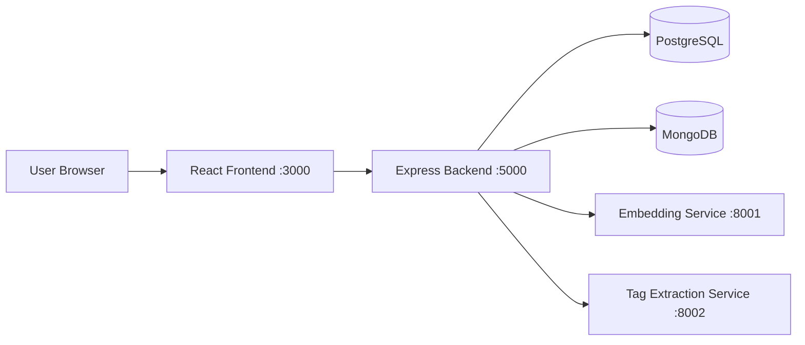
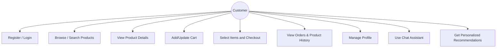
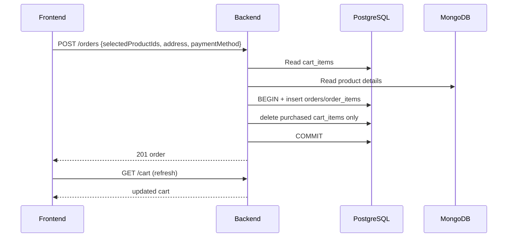
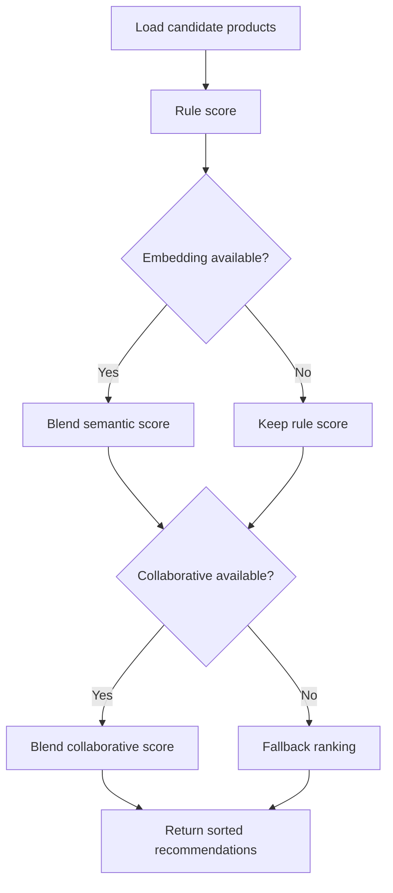

# CS5500 Final Project Report

## Project Title
**AI-Driven Personalized Shopping Experience for Hypermarket Retail**

---

## 1) Introduction & Problem Definition
Modern hypermarket shoppers face three practical issues:
1. **Low personalization**: generic recommendations do not reflect user preferences.
2. **Inefficient product discovery**: users spend too long searching products, especially seasonal/festival items.
3. **Fragmented experience**: weak integration between browsing, cart, orders, and customer assistance.

This project addresses the above by delivering a full-stack web system with a hybrid recommendation pipeline, shopping workflow, and AI-assisted interactions.

### Problem Statement
Traditional browsing-first retail interfaces lead to missed conversions and poor user satisfaction. We need a system that can:
- understand explicit user preferences,
- learn from behavior,
- produce explainable recommendations,
- and keep a stable user experience under real-world service failures.

---

## 2) Project Motivation and Scope

### Motivation
- Improve user experience and retention with relevant product ranking.
- Demonstrate applied AI engineering in a realistic retail workflow.
- Build a deployable, demo-ready system for course evaluation.

### Scope
In-scope:
- user account/profile management,
- catalog search and product detail,
- cart + partial checkout,
- order history + product view history,
- hybrid recommendation engine,
- AI chatbot integration slot,
- local-network demo deployment scripts.

Out-of-scope:
- real payment gateway,
- enterprise-scale distributed deployment,
- full production observability stack.

### Sprint Planning

The project follows Scrum with 2-week sprints. Sprint capacity: 5 team members, ~8-10 hours per member per week.

| Sprint | Phase | Duration | Goal | Status |
|---|---|---|---|---|
| Sprint 0 | Analysis | Jan 30 - Feb 9 | Requirements elicitation, scope definition, technology stack | Completed |
| Sprint 1 | System Design | Feb 10 - Mar 1 | Architecture, database schema, API contracts, wireframes | Completed |
| Sprint 2 | Core Infrastructure | Mar 2 - Mar 14 | User auth, product catalog, basic UI, database setup | Completed |
| Sprint 3 | AI & Advanced Features | Mar 15 - Mar 28 | Recommendation engine, festival module, chatbot, checkout | Completed |
| Sprint 4 | Testing & Hardening | Mar 29 - Apr 5 | Unit/integration testing, bug fixes, automated test suite | Completed |
| Buffer | Final Submission | Apr 6 - Apr 12 | Report, presentation, code cleanup, deployment | Completed |

---

## 3) Requirements Summary

### 3.1 Functional Requirements
- **FR-01** User registration/login with JWT.
- **FR-02** Profile management (language, cultural interests, dietary preferences).
- **FR-03** Product browsing/search/filter by category/festival.
- **FR-04** Cart operations (add/update/remove/clear).
- **FR-05** Checkout (simulated payment, promo validation, order creation).
- **FR-06** Account order history and recently viewed products (latest 20 unique products).
- **FR-07** Shopping list management and sync endpoint.
- **FR-08** Personalized recommendations (rule + embedding + collaborative).
- **FR-09** Festival-aware recommendations.
- **FR-10** Chat assistant API endpoint.

### 3.2 Non-Functional Requirements
- **NFR-01 Performance**: recommendation response target within practical demo latency.
- **NFR-02 Reliability**: graceful degradation when AI services are unavailable.
- **NFR-03 Security**: JWT authentication, hashed passwords, protected APIs.
- **NFR-04 Maintainability**: modular frontend/backend/recommendation separation.
- **NFR-05 Portability**: Windows/macOS scripts and cross-platform model paths.
- **NFR-06 Usability**: simple UI navigation and task completion without training.

### 3.3 User Stories

| ID | Story Points | User Story | Status |
|---|---|---|---|
| US-01 | 2 | As a consumer, I want to create an account so that I can receive personalized shopping features. | Completed |
| US-02 | 3 | As a consumer, I want to set dietary, language, and festival preferences so that recommendations match my needs. | Completed |
| US-03 | 4 | As a consumer, I want secure sign-in so that my profile and shopping data are protected. | Completed |
| US-04 | 3 | As a consumer, I want to browse and search products so that I can quickly find items to buy. | Completed |
| US-05 | 5 | As a consumer, I want AI recommendations so that I can discover products relevant to my preferences/history. | Completed |
| US-06 | 4 | As a consumer, I want festival-season suggestions so that I can prepare for upcoming events. | Completed |
| US-07 | 3 | As a consumer, I want to add/remove/update cart items so that I can prepare an order before checkout. | Completed |
| US-08 | 4 | As a consumer, I want a simulated checkout so that I can complete purchase flow safely in prototype mode. | Completed |
| US-09 | 1 | As a consumer, I want to see points and tier progress so that I understand my rewards. | Completed |
| US-10 | 2 | As a consumer, I want promotion logic explained so that I understand why discounts are applied. | Completed |
| US-11 | 3 | As a consumer, I want to create and manage shopping lists so that I can plan purchases efficiently. | Completed |
| US-12 | 4 | As a consumer, I want to see list sync status so that I know if in-store devices are up to date. | Completed |
| US-13 | 4 | As a consumer, I want chatbot help for product questions so that I can make faster decisions. | Completed |
| US-14 | 3 | As a consumer with dietary constraints, I want allergen checks so that I can avoid unsafe products. | Partially Completed |
| US-15 | 4 | As a consumer, I want control of personalization consent so that I choose how my data is used. | Deferred |

### 3.4 Constraints & Assumptions
- Local machine resources limit model inference throughput.
- PostgreSQL + MongoDB are available locally.
- Model files are downloaded locally (not checked into Git).
- Payment is simulated, not real transaction processing.

---

## 4) Proposed Features (High-Level)
- Personalized homepage recommendations.
- Festival-special and context-aware product ranking.
- User behavior logging and collaborative filtering.
- Product view history in account page.
- Selective checkout (choose which cart items to pay for).
- AI chatbot and recommendation strategy diagnostics.

---

## 5) Technology Stack and Justification

| Layer | Technology | Justification |
|---|---|---|
| Frontend | React 18, React Router, Axios | Fast UI development, SPA routing, stable HTTP client |
| Backend | Node.js, Express | Lightweight REST API and high development speed |
| Auth/Security | JWT, bcryptjs | Standard token auth and password hashing |
| Relational DB | PostgreSQL | Strong consistency for orders/carts/users |
| Document DB | MongoDB | Flexible product metadata and behavior logs |
| AI Embedding Service | Python + BAAI/bge-m3 | Semantic similarity for ranking blend |
| AI Tag Service | Python + Qwen2.5-7B-Instruct | Candidate tag extraction and enrichment |
| Tooling | Git, npm, PowerShell/Bash scripts | Version control and cross-platform operations |

---

## 6) Architecture & Design Summary

### 6.1 Architecture Style
A **layered client-server architecture** with optional local AI microservices:
- UI Layer (React)
- API Layer (Express)
- Data Layer (PostgreSQL + MongoDB)
- AI Service Layer (Embedding + Tag extraction)

### 6.2 Architecture Diagram (Mermaid)

### 6.3 Use Case Diagram (Mermaid)

### 6.4 UML Class Summary (Text)
Key backend modules:
- `routes/recommendations.js` (orchestrator)
- `recommendation/ranker.js` (rule scoring)
- `recommendation/collaborative.js` (behavior CF)
- `recommendation/embeddingClient.js`
- `recommendation/tagExtractionClient.js`
- `recommendation/behaviorLogger.js`

### 6.5 UML Sequence (Checkout, Simplified)

### 6.6 Activity (Recommendation Flow)

### 6.7 Database Schema (ER Summary)
- **PostgreSQL**: users, carts, cart_items, orders, order_items, user_addresses, shopping_lists, promotions, festivals
- **MongoDB**: products, chat_conversations, user_activity_logs
- Product ID is shared at application level across databases.

---

## 7) Implementation Summary

### 7.1 Core Modules Implemented
- Authentication and protected routes.
- Product listing/search/detail with behavior logging hooks.
- Cart and checkout flow with promo support.
- Account page with orders and new **View Product History**.
- Recommendation engine with:
  - rule-based scoring,
  - embedding blend,
  - collaborative filtering,
  - optional AI tag enrichment.

### 7.2 Major Enhancements Completed in Final Stage
1. **Behavior Collaborative Filtering engine** integrated.
2. **Event logging**: `view_product`, `search`, `add_to_cart`, `checkout`, `purchase`.
3. **View Product History (latest 20)** in account page.
4. **Partial checkout**: choose selected cart items to pay.
5. **Immediate cart refresh after payment** (no restart needed).
6. **Cross-platform startup scripts** and network demo support.
7. **Image fallback handling** for history cards.
8. **English-only runtime console output** in startup script.

### 7.3 Code Quality and Modularity
- Clear separation of frontend pages, contexts, API services.
- Backend routes separated by domain.
- Recommendation logic isolated under `backend/src/recommendation`.
- Non-blocking behavior logging design avoids breaking main flows.

### 7.4 Documentation Coverage
- Setup guide, DB schema doc, recommendation architecture summary.
- Scripts for start/stop on Windows and macOS/Linux.

---

## 8) Team Roles & Responsibilities

| Team Member | Primary Role(s) | Responsibilities |
|---|---|---|
| Yutao Zheng | Frontend Development, Backend API Development, Recommendation/ML Engineering | Page UI, routing, account/cart/checkout UX, network demo behavior; auth/users/orders/cart/products/recommendations routes; ranking strategy, collaborative filtering, embedding/tag services |
| Xingchen Liu | Database Integration, AI Chatbot Integration | PostgreSQL schema/seed, MongoDB collections/indexes; chat assistant API and conversation management |
| Xinyi Hu | Automated Testing (Jest), GitHub Project Management, Poster Design | Unit test suites (52 tests across 3 suites), CI test validation; GitHub issue tracking, milestone planning, branch management; project poster for presentation |
| Junyu Li | Supporting Role — Requirements Analysis, User Feedback | Requirements gathering, user acceptance feedback, feature validation |
| Lingyi Zhang | Supporting Role — Requirements Analysis, User Feedback | Requirements gathering, user acceptance feedback, feature validation |

---

## 9) Risk Analysis

| Risk | Impact | Mitigation |
|---|---|---|
| Local AI model startup latency/high memory | Slow demos, unstable UX | Feature toggles, caching, graceful fallback to rule-based ranking |
| Service dependency failure (Mongo/ML unavailable) | Partial feature outage | Health checks + degraded mode responses, non-blocking behavior logging |
| Cross-network demo connectivity issues | External users cannot access app | Bind frontend/backend to `0.0.0.0`, dynamic local IP detection, script automation |
| Data inconsistency across PG and Mongo | Incorrect cart/order enrichment | Transaction boundaries in PG, product existence checks, conservative fallback values |
| Last-minute regressions | Demo risk | Structured test checklist, incremental fixes, restart scripts |

---

## 10) Testing Summary

### 10.1 Test Plan
- **Scope**: auth, product flow, cart/checkout, account history, recommendation APIs, service startup.
- **Method**: manual integration testing + API health checks + lint/error checks.
- **Environment**: local full stack with PostgreSQL, MongoDB, ML services.

### 10.2 Unit Test Cases (Implemented)

Three test suites with 52 unit tests have been implemented using Jest:

**tagSystem.test.js (30 tests)**
- TAG_TAXONOMY structure validation (3 tests)
- inferProductTags: category, dietary, festival, price band, occasion inference, synonym resolution, deduplication (12 tests)
- buildUserTagProfile: dietary/festival tag building, empty/missing fields, synonym resolution (5 tests)
- tagOverlapScore: perfect/zero/partial overlap, empty inputs, defaults (6 tests)
- extractCandidateTagsHeuristic: dietary/festival extraction, price bands, deduplication, empty input (4 tests)

**ranker.test.js (16 tests)**
- Return structure validation (ranked array, weights, scoreBreakdown)
- Ranking correctness (higher-rated products ranked above lower-rated)
- Featured product bonus
- Tag overlap scoring for user preferences
- Embedding score blending and fallback
- Price affinity (budget vs organic user preference)
- Default weight values
- Edge cases (empty list, single product)
- Sort order verification

**authHelpers.test.js (6 tests)**
- mapUserRow: snake_case to camelCase conversion, null array defaults, password exclusion
- mapAddressRow: field mapping, boolean isDefault handling

All 52 tests pass. Run with `npm test`.

### 10.3 Integration Test Cases (Executed)
1. Register/login -> token accepted on protected endpoints.
2. Product view -> behavior log write -> account view-history displays records.
3. Select subset in cart -> checkout -> only selected items removed from cart.
4. Recommendation endpoint returns strategy diagnostics and fallback info.
5. Network access from other devices on same WiFi/hotspot works.

### 10.4 Test Summary
- **52 automated unit tests** across 3 test suites all pass (`npm test`).
- Core user journey (browse -> cart -> checkout -> order/account) passes.
- Recommendation pipeline works with optional AI components and fallback.
- Recent high-priority bugs fixed (cart consistency, hook error, image fallback, script encoding).

---

## 11) Bug Report Log (Final Iteration)

| ID | Bug | Root Cause | Fix |
|---|---|---|---|
| B-001 | Cart still shows purchased items until restart | Client state not refreshed + full-cart delete assumptions | Refresh cart after order; backend deletes only purchased selected items |
| B-002 | Cannot choose specific cart items for payment | No selection model in cart UI/API | Added per-item selection + `selectedProductIds` checkout payload |
| B-003 | Product history image broken | History card used missing `imageUrl` | Added image fallback and emoji placeholder |
| B-004 | ESLint hook error in CartPage | Hook called conditionally after early return | Reordered logic and removed conditional hook use |
| B-005 | Startup script output garbled | Non-ASCII console text in mixed encoding terminals | Converted runtime output to plain English ASCII |
| B-006 | Proxy/network startup issues | localhost-bound dev settings | Host binding and API URL wiring updated in scripts |

---

## 12) Version Control History (Git)
Recent commits indicate staged project evolution:
- `ede49ad2` add browsing activity + local network sharing
- `a5eb3fd9` add model to system
- `25e6db68` database and AI-chatbot integration
- `23bc1173` update ML system
- `b2096e99` backend and frontend baseline

Git is used throughout for incremental feature delivery and rollback safety.

---

## 13) Challenges Faced & Lessons Learned

### Challenges
1. Balancing recommendation quality vs response latency.
2. Coordinating multi-service startup reliability on local machines.
3. Handling cross-database joins at application layer.
4. Maintaining frontend state consistency after checkout transitions.

### Lessons Learned
- Graceful degradation is essential for AI-augmented systems.
- Feature flags and caching are practical performance controls.
- Early observability (`strategy` diagnostics, health endpoints) reduces debugging time.
- UX consistency (cart/account synchronization) is as important as algorithm quality.

---

## 14) Future Enhancements
1. Expand automated test coverage beyond current 52 unit tests (API integration tests, E2E tests).
2. Offline precomputation for AI tag enrichment to reduce online latency.
3. A/B testing framework for recommendation strategies.
4. Production deployment with HTTPS, reverse proxy, and monitoring dashboard.
5. Better analytics (CTR, conversion uplift, recommendation attribution).
6. Role-based admin panel for product/promo/recommendation tuning.

---

## 15) Final Deliverable Checklist
- [x] Working software with core shopping + recommendation features
- [x] Modular full-stack architecture
- [x] Documentation for setup/DB/recommendation architecture
- [x] Version-controlled development history
- [x] Integration test evidence from end-to-end scenarios
- [x] Automated unit test suite (52 tests, 3 suites, Jest)
- [ ] Formal ER/UML image assets checked into repo (text diagrams provided here)

---

## Appendix A: UI Wireframes / Mockups
- Early static mock pages existed under legacy `UI/` prototype.
- Final implementation uses React pages for production demo flow:
  Home, Search, Product Detail, Cart, Checkout, Account, Festival Specials, AI Recommendations.

## Appendix B: Assumptions for Demo Environment
- Same LAN/hotspot network for multi-device access.
- Ports 3000/5000/8001/8002 available.
- Databases and models already initialized.
